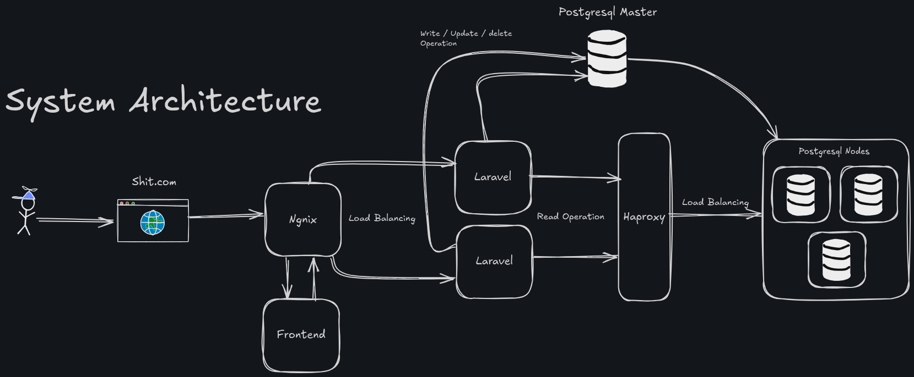

# PostgreSQL Replication Setup with Laravel, Nginx, and HAProxy

This project provides a comprehensive setup for a PostgreSQL replication environment integrated with a Laravel application, Nginx web server, and HAProxy load balancer, all running on VirtualBox. The setup is orchestrated using Ansible playbooks for automation.

> **Note**: This project is **not recommended** for production use. It is intended for development, testing, or educational purposes.

## Table of Contents

- [Architecture Overview](#architecture-overview)
- [Prerequisites](#prerequisites)
- [Technologies Used](#technologies-used)
- [Setup Instructions](#setup-instructions)
  - [Ansible Vault Configuration](#ansible-vault-configuration)
  - [Playbook Execution Order](#playbook-execution-order)
- [Directory Structure](#directory-structure)
- [Troubleshooting](#troubleshooting)
- [Contributing](#contributing)
- [License](#license)

## Architecture Overview

The architecture consists of a PostgreSQL master-slave replication setup, a Laravel application distributed across master and slave nodes, Nginx as the web server, and HAProxy for load balancing. All components are deployed on VirtualBox virtual machines.



### Components

- **PostgreSQL Master**: Primary database handling write operations.
- **PostgreSQL Slave**: Read-only replica synchronized with the master.
- **Laravel**: Backend application deployed on both master and slave nodes.
- **Nginx**: Web server for serving the Laravel frontend and backend.
- **HAProxy**: Load balancer to distribute traffic across nodes.
- **VirtualBox**: Virtualization platform for hosting the infrastructure.

## Prerequisites

Before starting, ensure the following requirements are met:

1. **Software Requirements**:

   - [Ansible](https://docs.ansible.com/ansible/latest/installation_guide/intro_installation.html) (version 2.9 or higher)
   - [VirtualBox](https://www.virtualbox.org/) (latest stable version)
   - [Vagrant](https://www.vagrantup.com/) (optional, for provisioning VMs)
   - Git

2. **Ansible Collections**:

   - Install the `community.postgresql` module (version 3.3.0):
     ```bash
     ansible-galaxy collection install community.postgresql:3.3.0
     ```

3. **GitHub and SSH Configuration**:

   - A GitHub personal access token for cloning private repositories.
   - An SSH key for secure access, stored in the Ansible vault.

4. **Ansible Vault**:

   - The password for all Ansible vault files is `123`. Update the vault password file or configure it as needed.

5. **Inventory File**:
   - Ensure the Ansible inventory file (`.ansible/inventories/inventory.yml`) is correctly configured with the IP addresses or hostnames of your VirtualBox VMs.

## Technologies Used

- **Laravel**: PHP framework for the backend and frontend application.
- **Nginx**: High-performance web server.
- **PostgreSQL**: Relational database with master-slave replication.
- **HAProxy**: Load balancer for distributing traffic.
- **VirtualBox**: Virtualization platform for hosting VMs.
- **Ansible**: Automation tool for configuration and deployment.

## Setup Instructions

### Ansible Vault Configuration

1. **Store Sensitive Data**:

   - Store your GitHub personal access token and SSH key in an Ansible vault file (e.g., `.ansible/vaults/secrets.yml`).
   - Example vault file content:
     ```yaml
     github_token: your_github_personal_access_token
     ssh_public_key: |
       ssh public key
     ```
   - Encrypt the vault file:
     ```bash
     ansible-vault encrypt .ansible/vaults/secrets.yml --vault-password-file .vault_pass.txt
     ```
   - Ensure the vault password file (`.vault_pass.txt`) contains the password `123`.

2. **Reference Vault in Playbooks**:
   - Update your playbooks to reference the vaulted variables as needed.

### Playbook Execution Order

Run the Ansible playbooks in the following order to ensure proper setup and configuration. Use the inventory file located at `.ansible/inventories/inventory.yml`.

```bash
# 1. Configure the PostgreSQL master
ansible-playbook .ansible/playbooks/postgresql_master_setup.yml -i .ansible/inventories/inventory.yml

# 2. Configure the PostgreSQL slave
ansible-playbook .ansible/playbooks/postgresql_slave_setup.yml -i .ansible/inventories/inventory.yml

# 3. Install and configure HAProxy
ansible-playbook .ansible/playbooks/haproxy_installation_configuration.yml -i .ansible/inventories/inventory.yml

# 4. Configure Laravel on the master node
ansible-playbook .ansible/playbooks/laravel_configuration_master.yml -i .ansible/inventories/inventory.yml

# 5. Configure Laravel on the slave node
ansible-playbook .ansible/playbooks/laravel_configuration_slave.yml -i .ansible/inventories/inventory.yml

# 6. Install and configure the frontend
ansible-playbook .ansible/playbooks/frontend_installation_configuration.yml -i .ansible/inventories/inventory.yml

# 7. Install and configure Nginx
ansible-playbook .ansible/playbooks/nginx_installation_configuration.yaml -i .ansible/inventories/inventory.yml
```

### Notes

- Ensure each playbook completes successfully before proceeding to the next.

## Directory Structure

```plaintext
project-root/
├── .ansible/
│   ├── inventories/
│   │   └── inventory.yml           # Ansible inventory file
│   ├── playbooks/
│   │   ├── postgresql_master_setup.yml
│   │   ├── postgresql_slave_setup.yml
│   │   ├── haproxy_installation_configuration.yml
│   │   ├── laravel_configuration_master.yml
│   │   ├── laravel_configuration_slave.yml
│   │   ├── frontend_installation_configuration.yml
│   │   └── nginx_installation_configuration.yml
│   ├── vaults/
│   │   └── secrets.yml            # Encrypted vault file
│   └── .vault_pass.txt            # Vault password file
├── architecture.png               # Architecture diagram
└── README.md                      # This file
```

## Troubleshooting

- **Ansible Vault Errors**:

  - Ensure the vault password file exists and contains `123`.
  - Verify that the vault file is correctly encrypted and referenced in playbooks.

- **PostgreSQL Replication Issues**:

  - Check the PostgreSQL logs on master and slave nodes (`/var/log/postgresql/`).
  - Ensure network connectivity between master and slave nodes.

- **HAProxy Connection Issues**:

  - Verify HAProxy configuration (`/etc/haproxy/haproxy.cfg`).
  - Check if the correct backend servers are defined.

- **Laravel Errors**:

  - Ensure the Laravel `.env` file is correctly configured with database credentials.
  - Run `php artisan migrate` on the master node after setup.

- **Nginx Errors**:
  - Check Nginx configuration syntax with `nginx -t`.
  - Review logs at `/var/log/nginx/error.log`.

## Contributing

Contributions are welcome! To contribute:

1. Fork the repository.
2. Create a new branch (`git checkout -b feature/your-feature`).
3. Make your changes and commit (`git commit -m "Add your feature"`).
4. Push to the branch (`git push origin feature/your-feature`).
5. Open a pull request.

Please ensure your changes are well-documented and tested.

## License

This project is licensed under the MIT License. See the [LICENSE](LICENSE) file for details.
